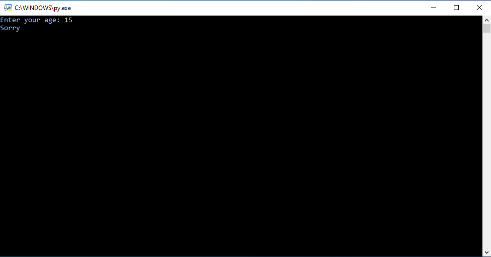

# else-statement
Simple program that controls entrance to a club. Only people who are 18 or older are allowed to enter the club.

The program takes the age of the person who tries to enter, and outputs "Allowed" if they are allowed to enter the club, and "Sorry" if they are younger than the allowed age.

Live demo [_here_](https://replit.com/@BartlomiejLis/else-statement).

## Table of Contents
* [Tech Stack](#tech-stack)
* [Screenshots](#screenshots)
* [Run Locally](#run-locally)
* [Project Status](#project-status)
* [Authors](#authors)

## Tech Stack
- Python

## Screenshots


## Run Locally
Clone the project

```bash
  git clone https://github.com/bartlomiejlis/else-statement.git
```

Go to the project directory and run main.py with Python.

The program works in text form. Follow instructions on your screen to start using it.

## Project Status
Project is: _no longer being worked on_.

## Authors
Created by Bartłomiej Lis - feel free to contact me at lisu.b117@gmail.com!
